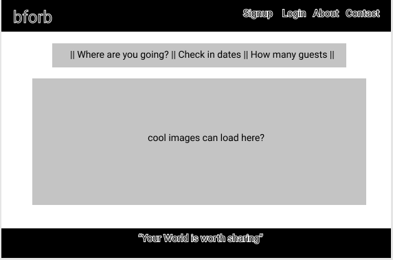
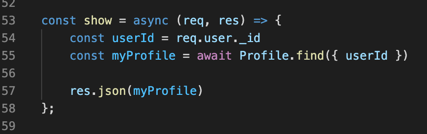
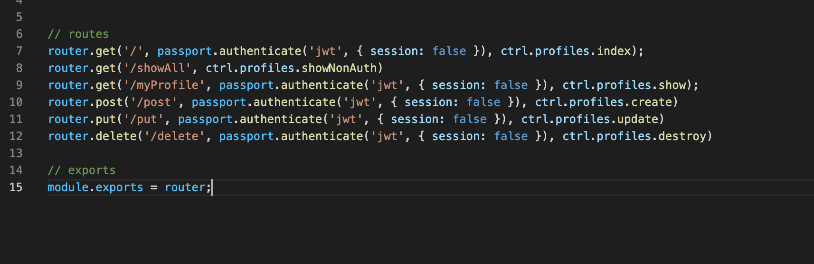
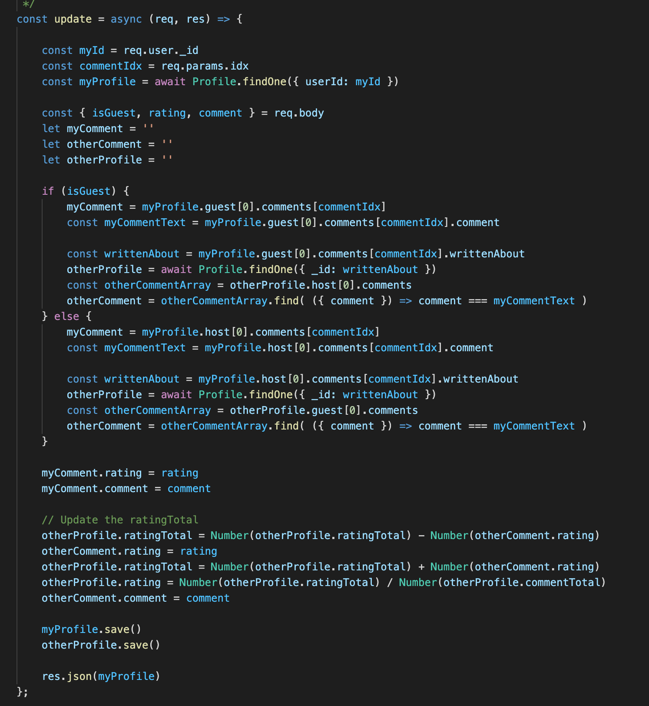

# bforb-p3
Project 3 for General Assembly

## Project READMEs at 

# bforb
You provide the bed the guest provides the breakfast. An airBnB experience that makes traveling an experience of a life time. 

bforb is an application where users can sign up to provide either a bed or breakfast.  If you provide a bed a guest who stays with you will then provide the breakfast.  Guests and Hosts can share experiences, cultures, talents, entertainment, and life!

### Motivation
This app is built to fulfill requirements for General Assembly SEI Project 3.

---
### Screenshots
screen captures of your app

---
### User Stories & Wireframes

As a user I want to choose between a host account or guest account.
As a user I want to be able to log in to the app.
I want to be able to peruse photos of places to stay.
I want to see information about the hosts of the places.

### Hosts: 
* As a host I will need to load profile, description and photos of my place and of myself
* As a host I will need to set times that I am unavailable/available
* I will have reviews from hosts or guests: both will display on the same page
* I will want to review the guests as they send a request:
    * safety information (light background check)
    * reviews from other hosts 
    * desire to share food/talents/breakfasts
    * expectations fo the host
* I will want a place where I can state directly my expectation of guests as far as
    * compensation
    * quiet hours
    * times to return to the house
* I will want to escalate guests behavior to support team

### Guests: 
* I will want to load profile:
    * description and photo of myself
    * description of my travel, why I travel, etc.
    * description of what I have to share (food/talent/breakfast)
    * light bckground check
* I will have reviews from hosts or guests: both will display on the same page
* I will want to search host profiles and see:
    * sleeping space
    * host expectation
    * host picture (profile, sleeping space)
* I want the opportunity within the app to find interesting restauarants and things to do in the city I'm visiting.
* I will want to escalate hosts behavior to support team.

### User: 
* Sign-In: Default neutral components
    * Profile pic
    * about me
    * Why do you travel?
    * Are you guest or hosts?

Stretch goals:
* User created events
* User discussion boards

---
### Technologies & Code Snippets

* list of technologies
* screen captures of your code

### Code Snippets 

##### Security Solved
When I first began building the database, I noticed our update routes were build to take in profileIds into the parameters.  However, if a user were to get ahold of someone elses profile id, then they could still update someone elses profile.

To solve this issue we grabbed profiles based on the authenticated users userId and tied the userId to the users Profile.  This means we never show the profileId in the URL and the authenticated user can only update their own profile.  See below: I need to audit my code and make sure this is still accurate.

##### Comment Dependencies
I began this process without considering the dependencies of each route.  This came to hurt me in the comments create and update route.  When a user creates a comment, the comment needs to be included on the hsots profile and the guests profile, and the otherProfile has to receive a rating which then updates the other users rating total.  

I wished that I had more time to refractor this code. But as my mentor in Seattle says "get it shipped, don't get it right."  This code is messy, but it works and updates all the dependencies that are tied to a single comment. 

---
### Credits
Give credit to any `codepen` that inspired you, `medium` article that helped you, or `stackoverflow` that pointed you in the right direction.

---

### Future development
##### Catch Errors in the backend:
* When I first started this project I anticipated the backend to take less time than it did and I planned for a full day of refractoring to include try/catch blocks and create new methods to make the code easier to read.  However, the comments controller had more dependencies than I originally envisioned and took more time to develop than anticipated.

##### Security issues:
* About halfway through the project I noticed if an authenticated user were to get a hold of someone elses userId and input that in the parameter of the website they could then update their profile.  I updated the profiles section to find a users profile based on the authenticated users id and not the parameter.  However, some methods still need to be audited and fixed. 

